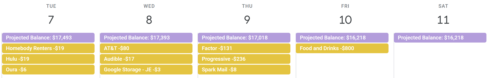
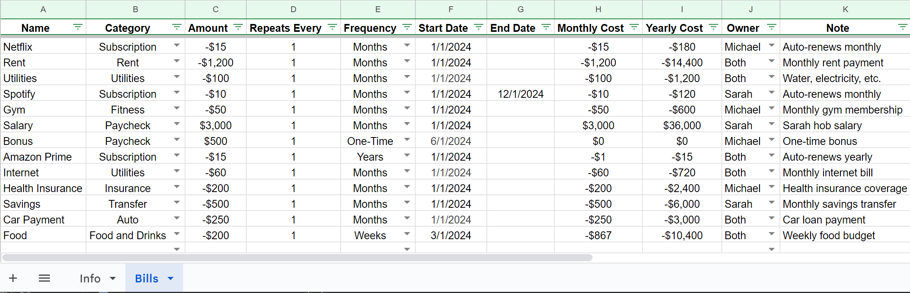
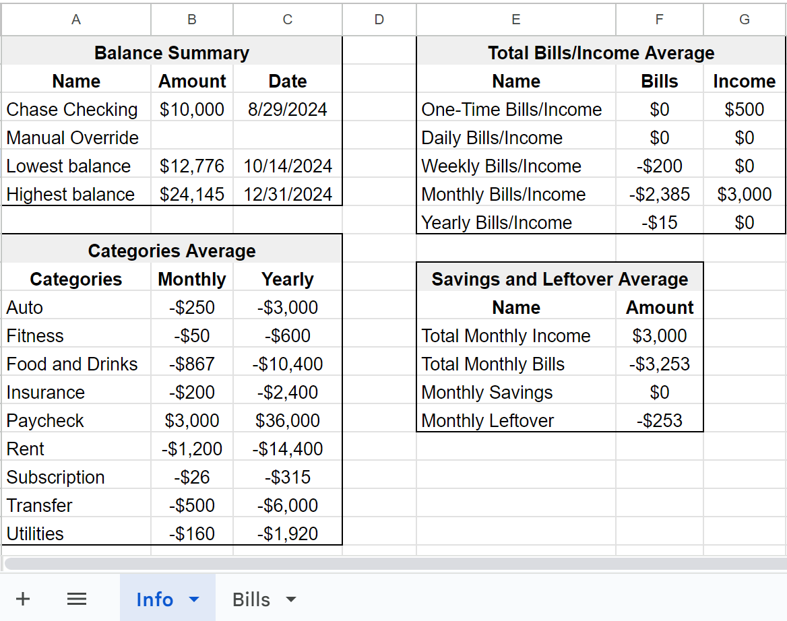

# Budget Calendar Project

The Budget Calendar project automates financial management by integrating **Google Sheets**, **Google Calendar**, and the **Monarch Money API**. It projects daily balances by reading bills and income data from Google Sheets and updates Google Calendar with the projected balances. The project also refreshes Monarch Money account balances using Selenium and retrieves the latest account balance to be used in balance projections.



---

## Overview

The Budget Calendar project automates personal financial management by:

- **Projecting Future Balances**: The system reads bills and income from a Google Spreadsheet and projects future balances for each day. These projections are added as events to Google Calendar.
- **Real-Time Balance Updates**: It integrates with the [Monarch Money API](https://github.com/hammem/monarchmoney) to pull current account balances. Selenium is used to refresh Monarch Money accounts to keep the balance data updated.
- **Google Sheets & Calendar Sync**: Bills and income data are fetched from Google Sheets, and upcoming transactions and balances are reflected in Google Calendar for an overview of your financial future.

---

## Sample Data

A sample Excel sheet (`sample_budget_sheet.xlsx`) is included in the `/sample_data/` folder. This file contains test data to demonstrate how the system processes and projects financial information.

### Sample Excel Sheets:

#### Bills Sheet Example



The bills sheet tracks all recurring and one-time expenses, which the system uses to project balances in the calendar.

#### Info Sheet Example



This sheet contains summary data, including current balance, manual balance overrides, and projections for the lowest and highest balances.

---

## Setup Instructions

### 1. Prerequisites

- **Python** 3.9 or higher
- Required Python packages:
  - Flask
  - Selenium
  - Aiohttp
  - Requests

### 2. Set Up a Virtual Environment

To ensure all dependencies are isolated to this project, it's recommended to use a **virtual environment**. Follow these steps to set it up:

1. Navigate to the project directory:
   
   ```bash
   cd budget-calendar
   ```

2. Create a virtual environment:

   ```bash
   python3 -m venv venv
   ```

3. Activate the virtual environment:

   - On **Windows**:
   
     ```bash
     venv\Scripts\activate
     ```
   
   - On **macOS/Linux**:
   
     ```bash
     source venv/bin/activate
     ```

4. Install the required packages:

   ```bash
   pip install -r requirements.txt
   ```

### 3. Clone the Repository

```bash
git clone https://github.com/bradyespey/budget-calendar.git
cd budget-calendar
```

### 4. Set Up Google Apps Script (GAS)

1. In the `/google_apps_scripts/` directory, you'll find `.js` files. Copy these into your Google Sheets Script Editor.
2. Set up the necessary triggers for automation (optional but recommended):
   - **Clear Manual Values.gs**  
     - **Purpose**: Clears any manually entered balance overrides.  
     - **Recommended Trigger**: Daily, between 6 AM and 7 AM.
  
   - **Accounts Refresh.gs**  
     - **Purpose**: Refreshes Monarch Money account balances to ensure the latest data is used for balance projections.  
     - **Recommended Trigger**: Daily, between 7 AM and 8 AM.

   - **Budget Script.gs**  
     - **Purpose**: Main function that retrieves balances, clears old calendar events, projects future balances, and updates Google Sheets.  
     - **Recommended Trigger**: Daily, between 8 AM and 9 AM.

   - **Custom Menu Function.gs**  
     - **Purpose**: Populates custom menu options in Google Sheets for manually running updates or clearing data.  
     - **Recommended Trigger**: On **spreadsheet open** to ensure the menu is available when the sheet is accessed.

### 5. Set Up Flask App

1. Ensure your virtual environment is activated.
2. Run the Flask app:

   ```bash
   python app.py
   ```

3. Access the API endpoints:
   - **Get balance**: `http://localhost:5003/budgetcalendar/get-balance/`
   - **Refresh accounts**: `http://localhost:5003/budgetcalendar/refresh-accounts/`

### 6. Optional: Automate Flask App Startup (Windows)

- Use **NSSM** to run Flask as a service. Install [NSSM](https://nssm.cc/), then configure the service:
   - **Application Path**: `C:\Users\espey\AppData\Local\Programs\Python\Python39\python.exe`
   - **Startup Directory**: `C:\Projects\GitHub\BudgetCalendar\`
   - **Arguments**: `C:\Projects\GitHub\BudgetCalendar\app.py`
   - **Log on Tab**: Set to Local System account
   - (Optional) **I/O Tab for logs**:
      - Output (stdout): `C:\Projects\BudgetCalendar\logs\flask_stdout.log`
      - Error (stderr): `C:\Projects\BudgetCalendar\logs\flask_stderr.log`
   - To start the service:

     ```bash
     nssm start BudgetCalendarApp
     ```

---

## Screenshots

### Calendar Overview


This shows the projected balances and scheduled bill payments in Google Calendar.

---

## License

This project is licensed under the MIT License. See the [LICENSE](LICENSE) file for details.

---

## Relevant Links

- [Monarch Money API Documentation](https://github.com/hammem/monarchmoney/tree/main?tab=readme-ov-file)
